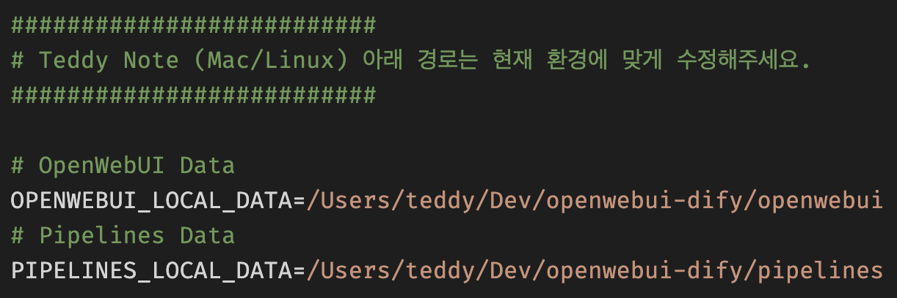
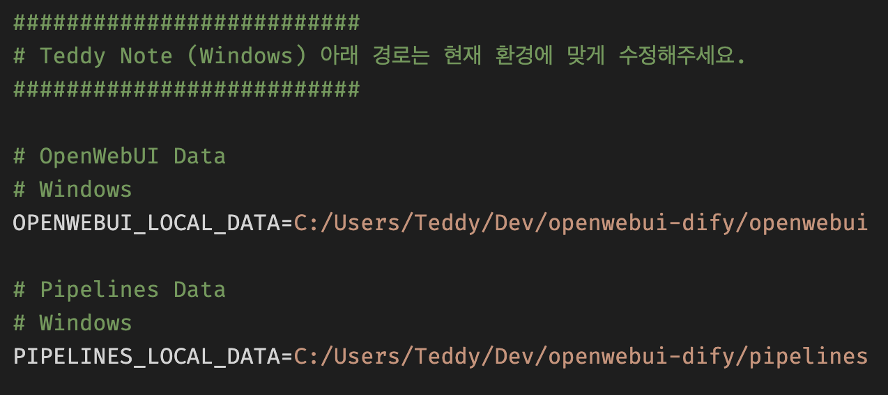
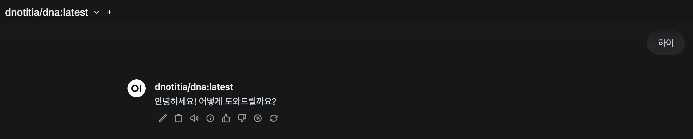
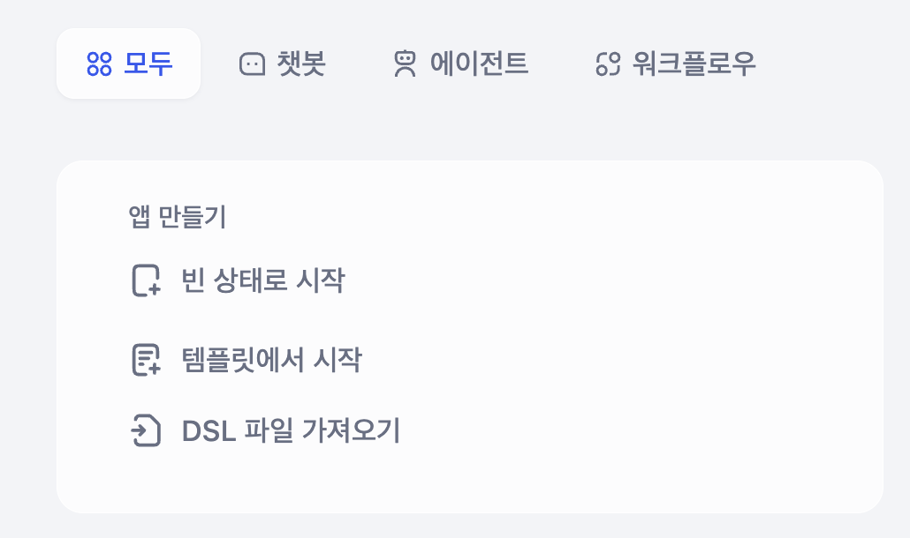

# Dify + OpenWebUI 설치 가이드

이 문서는 Dify와 OpenWebUI를 Docker 및 Ollama를 활용하여 설치하는 방법을 단계별로 안내합니다. 또한 Git을 이용해 프로젝트 파일을 다운로드하고 환경을 설정하는 방법, 그리고 컨테이너 실행 및 API 연결 설정 등 전체 워크플로우 구성에 관한 내용을 다룹니다.

**UBUNTU 설치 가이드** 는 [여기](README_UBUNTU.md) 문서를 참고해 주세요.

---

## 1. Docker Desktop 설치

Docker Desktop은 컨테이너 기반 애플리케이션 실행을 위한 플랫폼입니다.[^1]

### 1.1 다운로드 및 설치

- 다운로드 링크: https://www.docker.com/get-started/
- 설치 후 Docker Desktop의 dashboard를 실행하여 정상 설치 여부를 확인합니다.

> [!tip] Mac 사용자: 상단의 Docker 아이콘을 클릭 후 "Go to Dashboard"를 선택합니다.

  
  


---

## 2. Ollama 다운로드 및 설치

Ollama는 머신러닝 모델 실행을 위한 플랫폼입니다.[^2]

### 2.1 임베딩 모델 설정

1. 터미널을 열고, 다음 명령어로 설치된 모델 리스트를 확인합니다.

   ```bash
   ollama list
   ```

   > [!tip] 최초 설치 시 리스트가 비어있다면 정상입니다.

2. `bge-m3` 임베딩 모델 다운로드:

   ```bash
   ollama pull bge-m3
   ```

  


### 2.2 오픈 LLM 모델 다운로드 및 실행

1. `dnotitia/dna` 모델 다운로드:

   ```bash
   ollama pull dnotitia/dna
   ```

2. 모델 실행 상태 확인 (이미 실행 중이면 이 단계를 건너뛰세요):

   ```bash
   ollama run dnotitia/dna
   ```

   

   실행 후 `/bye` 입력하여 종료합니다.

---

## 3. Git 다운로드 및 설치

Git은 버전 관리 시스템으로, 프로젝트 파일을 다운로드하고 관리하는 데 사용됩니다.

### 3.1 MacOS / Linux

- 참고 영상:  
  https://youtu.be/mVu6Wj8Z7C0?si=Fh1Eu6j9q9IcXnaE&t=1311
- Brew를 통한 설치 참고:  
  https://teddynote.com/10-RAG%EB%B9%84%EB%B2%95%EB%85%B8%ED%8A%B8/%ED%99%98%EA%B2%BD%20%EC%84%A4%EC%A0%95%20(Mac)/

### 3.2 Windows

- 참고 영상:  
  https://youtu.be/mVu6Wj8Z7C0?si=Wr-CUNF0D8XY12yM&t=585
- 설치 매뉴얼:  
  https://teddynote.com/10-RAG%EB%B9%84%EB%B2%95%EB%85%B8%ED%8A%B8/%ED%99%98%EA%B2%BD%20%EC%84%A4%EC%A0%95%20(Windows)/

---

## 4. Git으로 프로젝트 다운로드

1. 터미널(Windows 사용자는 PowerShell)에서 다운로드 경로로 이동합니다.

   ```bash
   # 예시: 도큐먼트 폴더로 이동할 경우
   cd ~/Documents
   ```

2. 다음 명령어를 실행하여 프로젝트 파일을 클론합니다.

   ```bash
   git clone https://github.com/teddylee777/dify-openwebui.git
   ```

3. docker 폴더로 이동:

   ```bash
   cd dify-openwebui/docker
   ```

---

## 5. 프로젝트 파일 열기

프로젝트 폴더를 Cursor 또는 VS Code 등에서 열어 작업합니다.

  

---

## 6. .env 설정

1. `docker` 폴더 내부의 `.env.teddynote` 파일을 `.env`로 이름 변경합니다.
2. `.env` 파일의 하단에 데이터 저장 경로를 지정합니다.

아래의 경로는 예시이므로 변경하여 저장합니다.

> (경로 예시)
> - `/Users/teddy/Dev/openwebui-dify/openwebui`  
> - `/Users/teddy/Dev/openwebui-dify/pipelines`

  


---

## 7. Docker 컨테이너 실행

1. 터미널에서 `docker` 폴더로 이동합니다.

   ```bash
   cd dify-openwebui/docker
   ```

2. `docker-compose-teddynote.yaml` 파일을 이용해 컨테이너 실행:

   - 방법 1:

     ```bash
     docker compose -f docker-compose-teddynote.yaml up -d
     ```

   - 방법 2:

     ```bash
     docker-compose -f docker-compose-teddynote.yaml up -d
     ```


---

## 8. 컨테이너 중지

실행 중인 모든 컨테이너를 중지 및 삭제하려면:
```bash
docker stop $(docker ps -q) && docker rm $(docker ps -aq)
```

또는 Docker Desktop의 "Containers" 메뉴에서 전체 선택 후 "Delete"로 삭제합니다.


---

## 9. 포트(Port) 설정

설정된 포트는 다음과 같습니다.

- 80: Dify API
- 3000: OpenWebUI
- 11434: Ollama

추가로 Pipeline에서 사용되는 포트:

- 9099: OpenWebUI Pipeline

> [!tip] 외부 접속 허용 시 포트포워딩 설정을 확인하세요.

---

## 10. OpenWebUI 설정

1. 웹 브라우저에서 OpenWebUI 접속:  
   주소: http://localhost:3000/
2. 새 계정을 생성 후 로그인합니다.
   


---

## 11. 관리자 패널 및 API 연결 설정

### 11.1 OpenAI API 연결 관리

1. 관리자 패널 내 **프로필 > 관리자 패널 > 설정 > 연결** 메뉴에서 "OpenAI API 연결" 영역의 토글 버튼을 활성화합니다.
2. 우측 톱니바퀴 아이콘을 클릭하여 API 키를 입력하고 저장합니다.

  


### 11.2 Pipeline 연결 설정

1. 관리자 패널의 **프로필 > 관리자 패널 > 설정 > 연결** 메뉴에서 "OpenAI API 연결 관리" 영역 우측의 + 버튼을 클릭합니다.
2. 아래 정보를 입력합니다.
   - **URL**: `http://host.docker.internal:9099`
   - **Key**: `0p3n-w3bu!`


### 11.3 Ollama API 연결 지정

Ollama API 연결은 `http://host.docker.internal:11434`를 사용합니다.


---

## 12. 모델 활성화 및 채팅 설정

1. 관리자 패널에서 `dnotitia/dna` 모델의 토글 버튼을 눌러 활성화합니다.


2. 좌측 상단 **New Chat** 버튼 클릭 후 채팅창에서 `dnotitia/dna` 모델 선택 및 테스트 메시지 입력.



3. 왼쪽 하단 계정 클릭 후 관리자 패널로 이동하여, 파이프라인 관리 URL이 `http://host.docker.internal:9099`로 설정되어 있는지 확인합니다.


4. **설정 > 파이프라인** 메뉴에서 제공된 `dify_pipeline_local.py` 파일을 업로드합니다.
   - 파일 다운로드: https://link.teddynote.com/dify_pipeline_local


---

## 13. Dify 접속 및 워크플로우 구성

1. 웹 브라우저에서 Dify 접속:  
   링크: http://localhost/apps
2. 워크플로우 화면으로 이동 후, 제공된 DSL 파일을 import하여 테스트합니다.
   - 왼쪽 메뉴에서 "DSL 파일 가져오기" 클릭
   - 테스트용 파일 (예: 테디노트 챗봇.yml) import

  


3. 상용 모델 API 키 설정:  
   우측 상단 **계정** - **설정**에서 "모델 제공자" 항목에 API 키를 입력하면 워크플로우 구성 시 적용됩니다.

  


## 14. Ollama 모델 추가 예시

우측 상단 프로필 - 설정 - 왼쪽 탭 "모델 제공자" - Ollama 모델 추가

다음과 같이 설정하여 `dnotitia/dna` 모델을 추가합니다.


